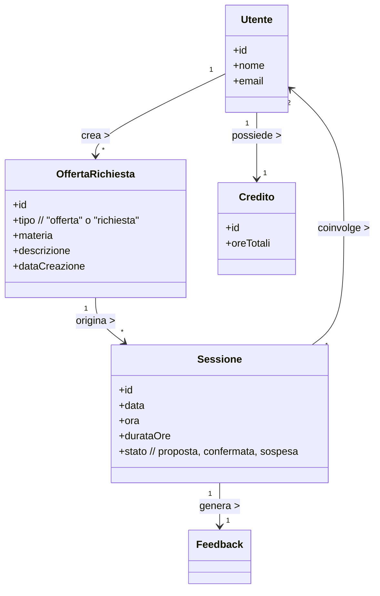
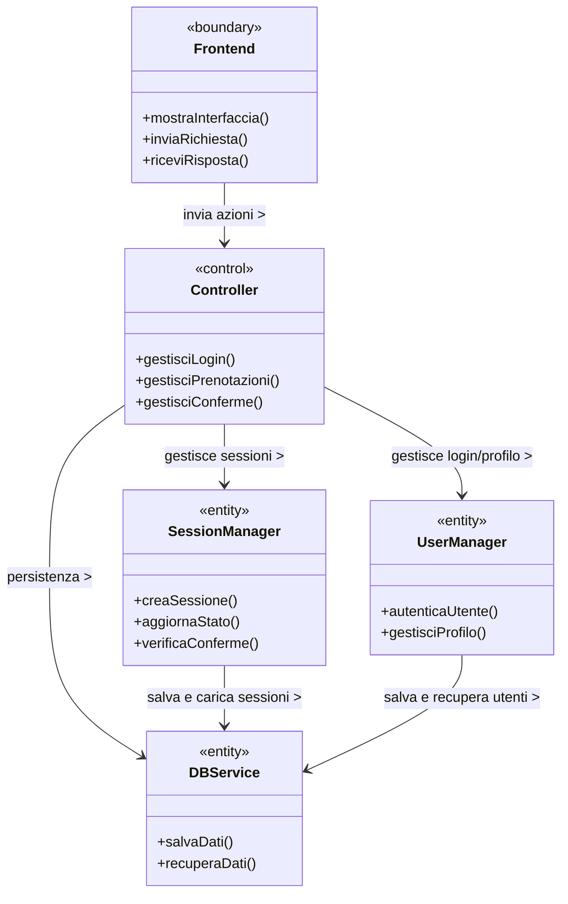

# Analisi

## Introduzione
In questa sezione vengono analizzati i requisiti e il dooooopominio applicativo del progetto unibo_tutiring.
L'obiettivo è definire in modo chiaro cosa dovrà fare la nostra applicazione e quali elementi caratterizzano il contesto, senza entrare nei dettagli tecnici o preogettuali.

## Analisi dei requisiti
L'applicazione unibo_tutoring nasce con lo scopo di creare una piattaforma digitale per gli studenti dell'università di Bologna in cui gi utenti possono mettersi in contatto per offrire o richiedere aiuti su specifiche materie.

**Requisiti funzionali**

L'applicazione dovrà permettere le seguenti funzionaloità principali:
- Gli studenti potranno registrarsi e autenticarsi usando la matricola universitaria, garantendo così che l'accesso sia riservato agli studenti uniBo
- Gli utenti potranno creare, modificare e eliminare box di offerta/richiesta di tutoraggio, in cui specificano il corso, la materia e una breve descrizione
- Potranno consultare le offerte e le richieste pubblicate da altri utenti, anche filtrandole per materia o corso
- Gli utenti potranno quindi proporre e accettare sessioni di tutoraggio, stabilendo data, orario e durata
- Ogni sessione dovrà passare attraverso diversi stati: proposta, confermata, conclusa
- Deve essere disponibile una chat privata per la comunicazione diretta tra tutor e studente, utile a concordare i dettagli dell'incontro
- Ogni utente dovrà disporre di un profilo personale, con le informazioni base (nome, cognome, matricola) e le attività svolte

**Requisiti non funzionali**

Oltre alle funzionalità principali, l'applicazione dovrà garantire una buona esperienza d'uso e un funzionamento stabile. In particolare:
- Semplicità d'uso: interfaccia chiara e intuitiva, pensata per studenti che devono orientarsi facilmetne tra le sezioni
- Affidabilità: i dati inseriti dagli utenti devono restare coerenti e sempre disponibili

## Analisi e modello del dominio

L'applicazione unibo_tutoring dovrà gestire le attività di tutoraggio tra studenti dell'Università di Bologna.
Il sistema ha lo scopo di favorire la collaborazione e il supporto reciproco tra studenti, permettendo a ciascuno di offrire o richiedere aiuto su specicìfiche materie universitarie e di accumulare crediti formativi in base alle ore di tutoraggio svolte.
Il dominio applicativo è costituito da una serie di entità e relazioni che descrivono le interazioni fondamentali tra gli studenti e gli elementi che compongono il servizio.
Ogni studente può assumere ruoli diversi a seconda del contesto: tutor, quando offre supporto su una materia, o studente, quando richiede aiuto.
Gli utenti interagiscono tramite la pubblicazione di box di tutoraggio, la creazione di sessioni di tutoraggio, e la comunicazine diretta attraverso una chat privata.

Gli elementi principali del dominio sono:
- Utente: rappresenta uno studente iscritto all'Università di Bologna.
- BoxTutoraggio: rappresenta un'offerta o una richiesta di tutoraggio. Contiene informazioni sulla materia e una breve descrizione.
- Sessione: indica un incontro di tutoraggio tra due utenti, caratterizzato da data, orario, durata e stato (proposta, confermata, conclusa)
- Chat: rappresenta il canale di ocmunicazione tra gli utenti che partecipano a una sessione.
- Credito: rappresenta il numero di ore e CFU accumulati dal tutor per le attività svolte.

La difficoltà  primaria sarà quella di gestire la coerenza dei ruoli tra offerta e richiesta, garantendo che le sessioni siano correttamente associate e confermate da entrambe le parti.
Un'ulteriore complessità riguarda il calcolo e la validazione dei crediti formativi, che devono riflettere con precisione le ore effettivamente svolte.
Infine, la gestione delle comunicazioni dirette e della prenotazione delle sessioni richiedono particolare attenzione per evitare sovrapposizioni di sessioni e per mantenere un sistema robusto e affidabile.
### Elementi positivi

### Elementi negativi

## Schema di analisi modello del dominio

Il sistema di tutoring gestisce studenti e tutor che possono proporre,
accettare o confermare sessioni di tutoraggio.  
Le entità principali del dominio sono `Utente`, `OffertaRichiesta`, `Sessione`,
`Feedback` e `Credito`.  
Lo schema seguente rappresenta i rapporti concettuali tra queste entità.

# Design

## Architettura
L'architettura dell'applicazione unibo_totoring segue il pattern MVC (Model-View-Controller).
In questa architettura, le tre componenti principali (Model, View e Controller) cooperano per gestire le funzinalità di tutoraggio, la persistenza dei dati e l'interazione con l'utente.
- Model: rappresenta il dominio applicativo: gestisce le entità principali (Utente, boxTutoraggio, Sessione, Chat, Credito) e le relazioni tra loro. Si occupa della logica dei dati, del calcolo dei crediti e dello ststo delle sessioni.
- Controller: coordina le azioni dell'utente e media tra Model e View. È responsabile del flusso delle operazioni, come la creazione di un box di tutoraggio, la proposta di una sessione, o l'invio di messaggi in chat.
- View: gestisce la parte grafica e interattiva dell'applicazione, mostrando i dati ricevuti dal Controller e aggiornandosi in base alle modifiche del Model.

Questa suddivisione consente di mantenere il codice modulare, facilitando la gestione delle diverse sezioni dell'app (Dashboard, Chat, Profilo, ecc...) e rendendo possibile l'estensione futura con nuove funzionalità, come ad esempio l'integrazione con Teams.

 

L’applicazione di tutoring segue un’architettura di tipo **MVC**, (Model–View–Controller), ispirata al pattern **ECB** (Entity–Control–Boundary). Il frontend gestisce l’interfaccia e la comunicazione con l’utente, il controller coordina le operazioni principali e interagisce con i gestori di dominio, mentre il database garantisce la persistenza delle informazioni.

### Architettura – Schema UML

 

## Design dettagliato

