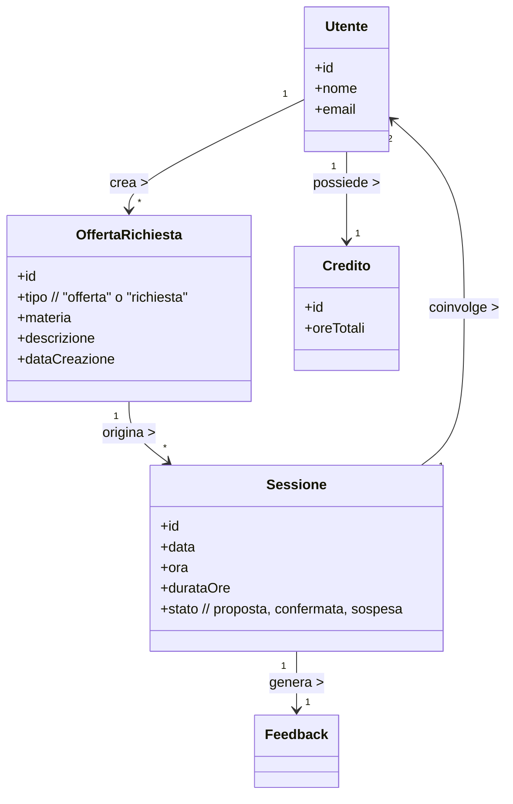
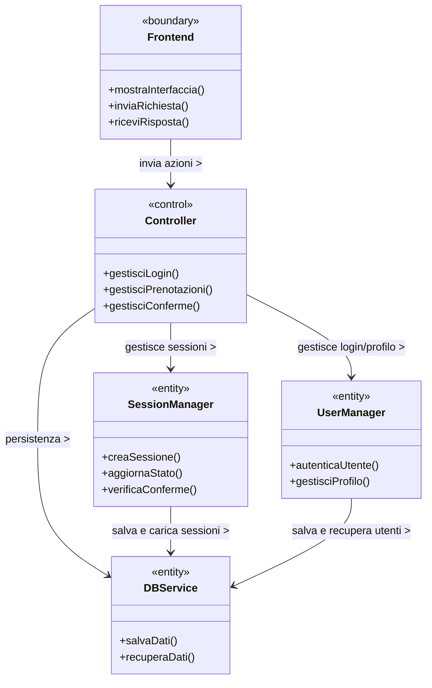
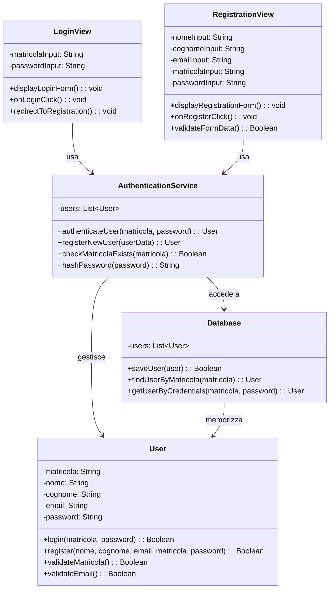
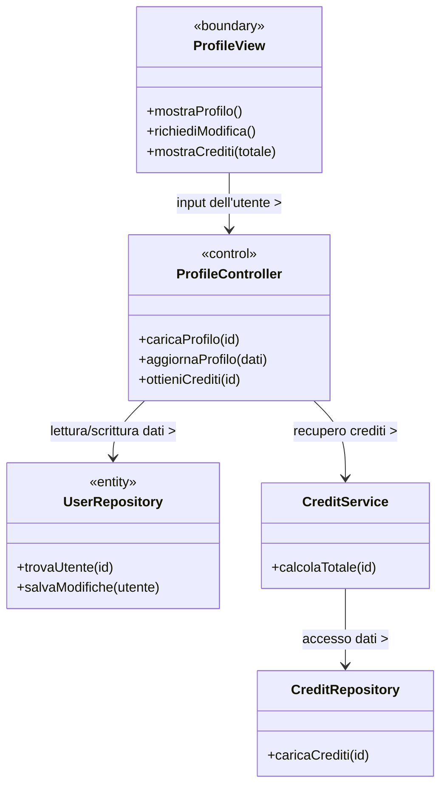
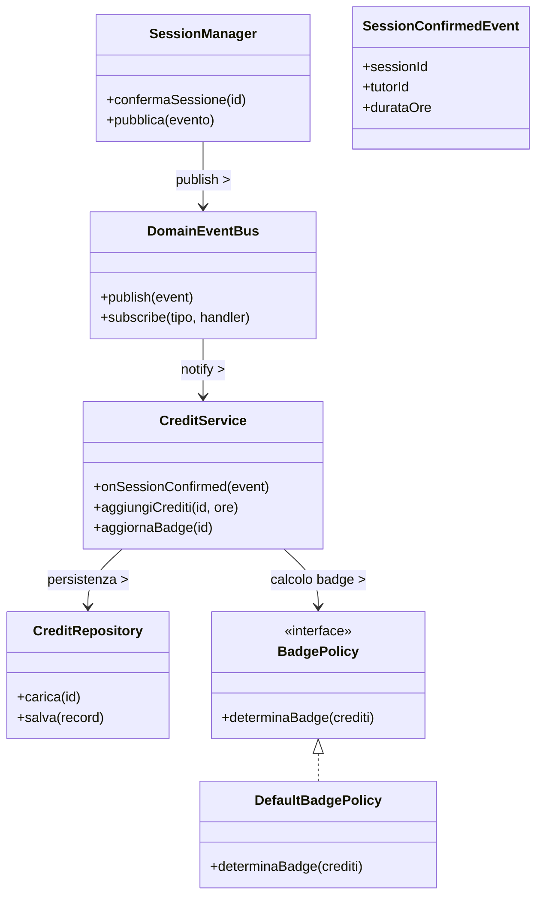
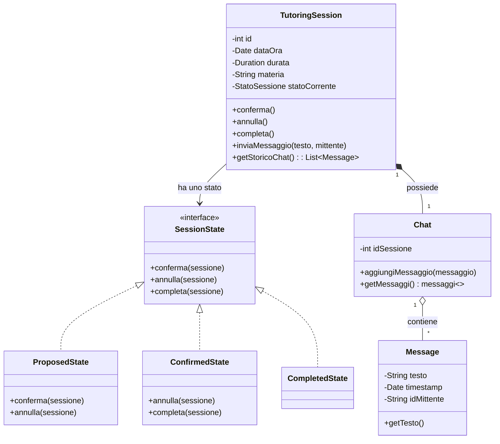
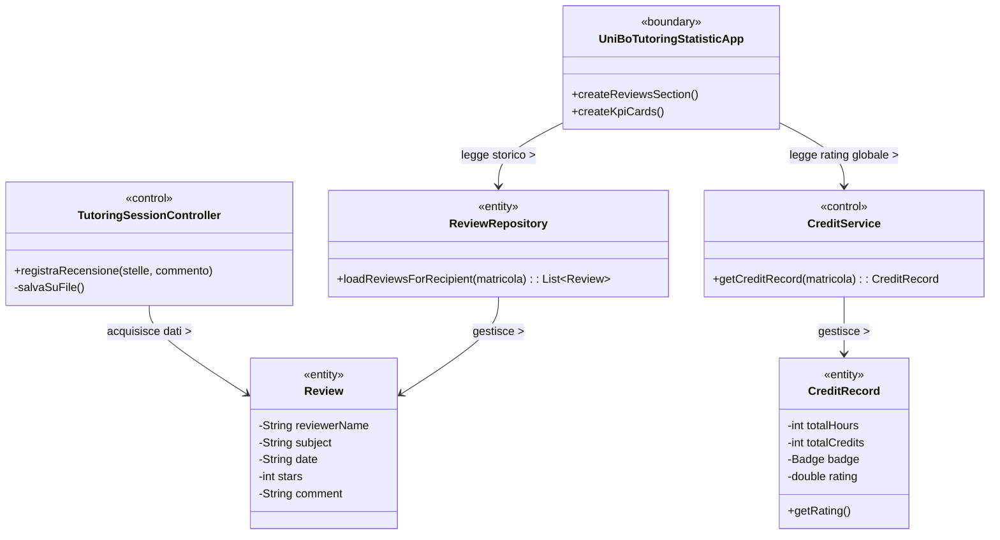
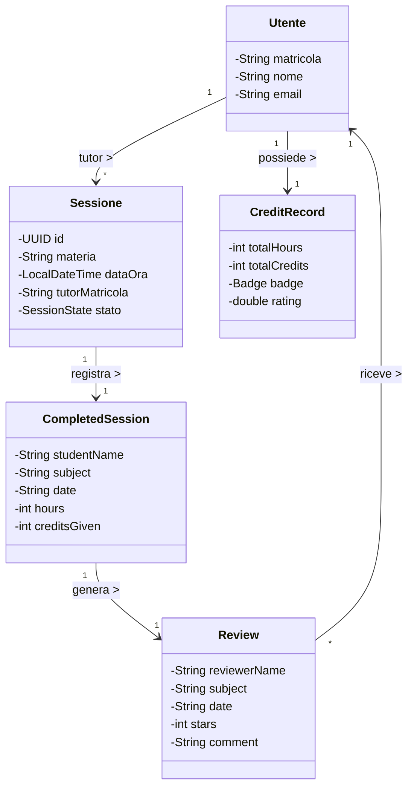

# Analisi

## Introduzione
In questa sezione vengono analizzati i requisiti e il dominio applicativo del progetto unibo_tutoring.
L'obiettivo è definire in modo chiaro cosa dovrà fare la nostra applicazione e quali elementi caratterizzano il contesto, senza entrare nei dettagli tecnici o progettuali.

## Analisi dei requisiti
L'applicazione unibo_tutoring nasce con lo scopo di creare una piattaforma digitale per gli studenti dell'Università di Bologna in cui gli utenti possono mettersi in contatto per offrire o richiedere aiuti su specifiche materie.

**Requisiti funzionali**

L'applicazione dovrà permettere le seguenti funzionalità principali:
- Gli studenti potranno registrarsi e autenticarsi usando la matricola universitaria, garantendo così che l'accesso sia riservato agli studenti uniBo
- Gli utenti potranno creare, modificare ed eliminare box di offerta/richiesta di tutoraggio, in cui specificano il corso, la materia e una breve descrizione
- Potranno consultare le offerte e le richieste pubblicate da altri utenti, anche filtrandole per materia o corso
- Gli utenti potranno quindi proporre e accettare sessioni di tutoraggio, stabilendo data, orario e durata
- Ogni sessione dovrà passare attraverso diversi stati: proposta, confermata, conclusa
- Deve essere disponibile una chat privata per la comunicazione diretta tra tutor e studente, utile a concordare i dettagli dell'incontro
- Ogni utente dovrà disporre di un profilo personale, con le informazioni base (nome, cognome, matricola) e le attività svolte

**Requisiti non funzionali**

Oltre alle funzionalità principali, l'applicazione dovrà garantire una buona esperienza d'uso e un funzionamento stabile. In particolare:
- Semplicità d'uso: interfaccia chiara e intuitiva, pensata per studenti che devono orientarsi facilmente tra le sezioni
- Affidabilità: i dati inseriti dagli utenti devono restare coerenti e sempre disponibili

## Analisi e modello del dominio

L'applicazione unibo_tutoring dovrà gestire le attività di tutoraggio tra studenti dell'Università di Bologna.
Il sistema ha lo scopo di favorire la collaborazione e il supporto reciproco tra studenti, permettendo a ciascuno di offrire o richiedere aiuto su specifiche materie universitarie e di accumulare crediti formativi in base alle ore di tutoraggio svolte.
Il dominio applicativo è costituito da una serie di entità e relazioni che descrivono le interazioni fondamentali tra gli studenti e gli elementi che compongono il servizio.
Ogni studente può assumere ruoli diversi a seconda del contesto: tutor, quando offre supporto su una materia, o studente, quando richiede aiuto.
Gli utenti interagiscono tramite la pubblicazione di box di tutoraggio, la creazione di sessioni di tutoraggio, e la comunicazione diretta attraverso una chat privata.

Gli elementi principali del dominio sono:
- Utente: rappresenta uno studente iscritto all'Università di Bologna.
- BoxTutoraggio: rappresenta un'offerta o una richiesta di tutoraggio. Contiene informazioni sulla materia e una breve descrizione.
- Sessione: indica un incontro di tutoraggio tra due utenti, caratterizzato da data, orario, durata e stato (proposta, confermata, conclusa)
- Chat: rappresenta il canale di comunicazione tra gli utenti che partecipano a una sessione.
- Credito: rappresenta il numero di ore e CFU accumulati dal tutor per le attività svolte.

La difficoltà primaria sarà quella di gestire la coerenza dei ruoli tra offerta e richiesta, garantendo che le sessioni siano correttamente associate e confermate da entrambe le parti.
Un'ulteriore complessità riguarda il calcolo e la validazione dei crediti formativi, che devono riflettere con precisione le ore effettivamente svolte.
Infine, la gestione delle comunicazioni dirette e della prenotazione delle sessioni richiedono particolare attenzione per evitare sovrapposizioni di sessioni e per mantenere un sistema robusto e affidabile.

## Schema di analisi modello del dominio

Il sistema di tutoring gestisce studenti e tutor che possono proporre,
accettare o confermare sessioni di tutoraggio.  
Le entità principali del dominio sono `Utente`, `OffertaRichiesta`, `Sessione`,
`Feedback` e `Credito`.  
Lo schema seguente rappresenta i rapporti concettuali tra queste entità.


```mermaid
classDiagram
    %% ============================
    %% UML DEL DOMINIO - UNIBO TUTORING APP
    %% ============================

    class Utente {
        +id
        +nome
        +email
    }

    class OffertaRichiesta {
        +id
        +tipo  // "offerta" o "richiesta"
        +materia
        +descrizione
        +dataCreazione
    }

    class Sessione {
        +id
        +data
        +ora
        +durataOre
        +stato  // proposta, confermata, sospesa
    }


    class Credito {
        +id
        +oreTotali
    }

    %% ============================
    %% RELAZIONI DEL DOMINIO
    %% ============================
    Utente "1" --> "*" OffertaRichiesta : crea >
    OffertaRichiesta "1" --> "*" Sessione : origina >
    Sessione "1" --> "2" Utente : coinvolge >
    Sessione "1" --> "1" Feedback : genera >
    Utente "1" --> "1" Credito : possiede >
```
# Design

## Architettura
L'architettura dell'applicazione unibo_tutoring segue il pattern MVC (Model-View-Controller).
In questa architettura, le tre componenti principali (Model, View e Controller) cooperano per gestire le funzionalità di tutoraggio, la persistenza dei dati e l'interazione con l'utente.
- Model: rappresenta il dominio applicativo: gestisce le entità principali (Utente, boxTutoraggio, Sessione, Chat, Credito) e le relazioni tra loro. Si occupa della logica dei dati, del calcolo dei crediti e dello stato delle sessioni.
- View: gestisce la parte grafica e interattiva dell'applicazione, mostrando i dati ricevuti dal Controller e aggiornandosi in base alle modifiche del Model.
- Controller: coordina le azioni dell'utente e media tra Model e View. È responsabile del flusso delle operazioni, come la creazione di un box di tutoraggio, la proposta di una sessione, o l'invio di messaggi in chat.

Questa suddivisione consente di mantenere il codice modulare, facilitando la gestione delle diverse sezioni dell'app (Dashboard, Chat, Profilo, ecc...) e rendendo possibile l'estensione futura con nuove funzionalità, come ad esempio l'integrazione con Teams.

 

L’applicazione di tutoring segue un’architettura di tipo **MVC**, (Model–View–Controller), ispirata al pattern **ECB** (Entity–Control–Boundary). Il frontend gestisce l’interfaccia e la comunicazione con l’utente, il controller coordina le operazioni principali e interagisce con i gestori di dominio, mentre il database garantisce la persistenza delle informazioni.

### Architettura – Schema UML


```mermaid
classDiagram
    %% =====================================
    %% UML ARCHITETTURALE - UNIBO_TUTORING
    %% Pattern MVC / ECB
    %% =====================================

    class Frontend {
        +mostraInterfaccia()
        +inviaRichiesta()
        +riceviRisposta()
    }
    <<boundary>> Frontend

    class Controller {
        +gestisciLogin()
        +gestisciPrenotazioni()
        +gestisciConferme()
    }
    <<control>> Controller

    class UserManager {
        +autenticaUtente()
        +gestisciProfilo()
    }
    <<entity>> UserManager

    class SessionManager {
        +creaSessione()
        +aggiornaStato()
        +verificaConferme()
    }
    <<entity>> SessionManager

    class DBService {
        +salvaDati()
        +recuperaDati()
    }
    <<entity>> DBService

    %% RELAZIONI
    Frontend --> Controller : invia azioni >
    Controller --> UserManager : gestisce login/profilo >
    Controller --> SessionManager : gestisce sessioni >
    Controller --> DBService : persistenza >
    SessionManager --> DBService : salva e carica sessioni >
    UserManager --> DBService : salva e recupera utenti >
```

## Design dettagliato- Gestione fasi Login e Registrazione
Il diagramma delle classi UML rappresenta la struttura del sistema di autenticazione del sito di tutoring, mostrando le principali classi coinvolte nel processo di registrazione e login degli utenti tramite numero di matricola e password.
Il sistema è organizzato secondo una separazione tra interfaccia utente, logica applicativa e gestione dei dati.


```mermaid
classDiagram
    class User {
        -matricola: String
        -nome: String
        -cognome: String
        -email: String
        -password: String
        +login(matricola, password): Boolean
        +register(nome, cognome, email, matricola, password): Boolean
        +validateMatricola(): Boolean
        +validateEmail(): Boolean
    }
    class AuthenticationService {
        -users: List~User~
        +authenticateUser(matricola, password): User
        +registerNewUser(userData): User
        +checkMatricolaExists(matricola): Boolean
        +hashPassword(password): String
    }
    class LoginView {
        -matricolaInput: String
        -passwordInput: String
        +displayLoginForm(): void
        +onLoginClick(): void
        +redirectToRegistration(): void
    }
    class RegistrationView {
        -nomeInput: String
        -cognomeInput: String
        -emailInput: String
        -matricolaInput: String
        -passwordInput: String
        +displayRegistrationForm(): void
        +onRegisterClick(): void
        +validateFormData(): Boolean
    }
    class Database {
        -users: List~User~
        +saveUser(user): Boolean
        +findUserByMatricola(matricola): User
        +getUserByCredentials(matricola, password): User
    }
    LoginView --> AuthenticationService: usa
    RegistrationView --> AuthenticationService: usa
    AuthenticationService --> Database: accede a
    AuthenticationService --> User: gestisce
    Database --> User: memorizza
```

## Classe User
La classe User rappresenta l'entità principale del sistema, ovvero l'utente registrato alla piattaforma.
Gli attributi della classe contengono le informazioni personali necessarie per l'identificazione dell'utente:
- matricola: identificativo univoco dello studente
- nome: nome dell'utente
- cognome: cognome dell'utente
- email: indirizzo email dell'utente
- password: password associata all'account

La classe include inoltre diversi metodi che permettono la gestione delle operazioni di autenticazione:
- login(): verifica le credenziali inserite dall'utente per accedere al sistema
- register(): permette la creazione di un nuovo account utente
- validateMatricola(): controlla la validità del formato della matricola
- validateEmail(): verifica la correttezza dell'indirizzo email

## Classe AuthenticationService
La classe AuthenticationService gestisce la logica principale del sistema di autenticazione.
Essa funge da livello intermedio tra l'interfaccia utente e il database.

Gli attributi includono una lista di utenti registrati: users: List<User>

I metodi principali sono:
- authenticateUser(): verifica se la matricola e la password inserite corrispondono a un utente registrato
- registerNewUser(): gestisce il processo di registrazione di un nuovo utente
- checkMatricolaExists(): controlla se una matricola è già presente nel sistema
- hashPassword(): converte la password in formato cifrato per garantire maggiore sicurezza

## Classe LoginView
La classe LoginView rappresenta l'interfaccia grafica utilizzata dall'utente per effettuare l'accesso al sistema.
Gli attributi rappresentano i campi inseriti dall'utente ovvero matricolaInput e passwordInput.

I metodi gestiscono l'interazione con l'interfaccia:
- displayLoginForm(): mostra il modulo di login
- onLoginClick(): gestisce il tentativo di accesso dell'utente
- redirectToRegistration(): reindirizza l'utente alla pagina di registrazione nel caso non sia ancora registrato

## Classe RegistrationView

La classe RegistrationView invece, rappresenta l'interfaccia grafica per la registrazione di nuovi utenti.
Gli attributi corrispondono ai campi del modulo di registrazione quindi nomeInput,cognomeInput, emailInput, matricolaInput e passwordInput.

I metodi principali sono:
- displayRegistrationForm(): visualizza il modulo di registrazione
- onRegisterClick(): gestisce la richiesta di registrazione
- validateFormData(): verifica che tutti i dati inseriti siano corretti prima dell'invio

## Classe Database
La classe Database rappresenta il sistema di persistenza dei dati e contiene le informazioni sugli utenti registrati.
Essa include users: List<User>, che rappresenta l'insieme degli utenti memorizzati.

I metodi principali sono:
- saveUser(): salva un nuovo utente nel database
- findUserByMatricola(): ricerca un utente tramite matricola
- getUserByCredentials(): restituisce l'utente corrispondente alle credenziali inserite


## Design dettagliato- Gestione Profilo Utente


```mermaid
classDiagram
    %% ============================================================
    %% DESIGN DETTAGLIATO - PROFILO UTENTE(NIKI)
    %% Pattern: ECB (Entity-Control-Boundary)
    %% ============================================================

    class ProfileView {
        +mostraProfilo()
        +richiediModifica()
        +mostraCrediti(totale)
    }
    <<boundary>> ProfileView

    class ProfileController {
        +caricaProfilo(id)
        +aggiornaProfilo(dati)
        +ottieniCrediti(id)
    }
    <<control>> ProfileController

    class UserRepository {
        +trovaUtente(id)
        +salvaModifiche(utente)
    }
    <<entity>> UserRepository

    class CreditService {
        +calcolaTotale(id)
    }
 class CreditRepository {
        +caricaCrediti(id)
    }
    %% RELAZIONI
    ProfileView --> ProfileController : input dell'utente >
    ProfileController --> UserRepository : lettura/scrittura dati >
    ProfileController --> CreditService : recupero crediti >
    CreditService --> CreditRepository : accesso dati >
```
## SISTEMA ASSEGNAZIONE CREDITI & BADGE 

```mermaid
classDiagram
    %% ============================================================
    %% DESIGN DETTAGLIATO - CREDITI & BADGE (NIKI)
    %% Pattern: Observer + Strategy
    %% ============================================================

    class SessionManager {
        +confermaSessione(id)
        +pubblica(evento)
    }

    class SessionConfirmedEvent {
        +sessionId
        +tutorId
        +durataOre
    }

    class DomainEventBus {
        +publish(event)
        +subscribe(tipo, handler)
    }

    class CreditService {
        +onSessionConfirmed(event)
        +aggiungiCrediti(id, ore)
        +aggiornaBadge(id)
    }

    class CreditRepository {
        +carica(id)
        +salva(record)
    }

    class BadgePolicy {
        +determinaBadge(crediti)
    }
    <<interface>> BadgePolicy

    class DefaultBadgePolicy {
        +determinaBadge(crediti)
    }
    %% RELAZIONI
    SessionManager --> DomainEventBus : publish >
    DomainEventBus --> CreditService : notify >
    CreditService --> CreditRepository : persistenza >
    CreditService --> BadgePolicy : calcolo badge >
    BadgePolicy <|.. DefaultBadgePolicy
```
## GESTIONE SESSIONI E CHAT

Gli utenti di unibo_tutoring hanno la possibilità di poter scambiare dei messaggi fra di loro. Oltre ai messaggi ci deve essere la possibilità di poter offrire o richiedere un'offerta di tutoraggio la quale può essere proposta, confermata, o conclusa.



```mermaid
  %% ============================================================
    %% DESIGN DETTAGLIATO - SESSIONI E CHAT (ANDREA)
    %% Pattern: Observer + Strategy
    %% ============================================================

    classDiagram

    class TutoringSession {
        -int id
        -Date dataOra
        -Duration durata
        -String materia
        -StatoSessione statoCorrente
        +conferma()
        +annulla()
        +completa()
        +inviaMessaggio(testo, mittente)
        +getStoricoChat() : List~Message~
    }

    %% PATTERN STATE: Gestione degli stati
    class SessionState {
        <<interface>>
        +conferma(sessione)
        +annulla(sessione)
        +completa(sessione)
    }

    class ProposedState {
 
        +conferma(sessione)
        +annulla(sessione)
    }

    class ConfirmedState {

        +annulla(sessione)
        +completa(sessione)
    }

    class CompletedState {

    }

    TutoringSession --> SessionState : ha uno stato 
    SessionState <|.. ProposedState
    SessionState <|.. ConfirmedState
    SessionState <|.. CompletedState

    class Chat {
        -int idSessione
        +aggiungiMessaggio(messaggio)
        +getMessaggi() messaggi<>
    }

    class Message {
        -String testo
        -Date timestamp
        -String idMittente
        +getTesto()
    }

    
    TutoringSession "1" *-- "1" Chat : possiede 
    Chat "1" o-- "*" Message : contiene 
```
### Scelte Progettuali: Gestione Sessioni e Chat (Andrea)

Il modulo relativo alla gestione delle sessioni di tutoraggio e della messaggistica privata è stato progettato per massimizzare la flessibilità e separare chiaramente le responsabilità.

#### 1. Gestione del ciclo di vita della Sessione (State Pattern)
Una `TutoringSession` attraversa diverse fasi durante il suo ciclo di vita (Proposta, Confermata, Conclusa). Invece di gestire queste transizioni tramite complessi e fragili blocchi `if/switch` all'interno della classe principale, si è optato per l'utilizzo del **Pattern State**.
* **`SessionState` (Interfaccia):** Definisce le azioni possibili su una sessione (`conferma()`, `annulla()`, `completa()`).
* **Stati Concreti (`ProposedState`, `ConfirmedState`, `CompletedState`):** Implementano le transizioni consentite. Ad esempio, chiamare `conferma()` su uno stato `ProposedState` sposterà la sessione in `ConfirmedState`, mentre chiamare la stessa operazione su una sessione già in `CompletedState` solleverà un'eccezione, garantendo la coerenza del dominio.
* **Vantaggi:** Questo approccio rispetta l'*Open/Closed Principle*. Qualora in futuro si decidesse di aggiungere un nuovo stato (es. `SuspendedState`), basterà creare una nuova classe senza dover modificare la logica preesistente della `TutoringSession`.

#### 2. Architettura della Chat Privata (Composizione e Observer)
La `Chat` è modellata come un'entità separata, ma legata alla `TutoringSession` tramite una relazione di **Composizione**.
* La classe `TutoringSession` fa da facciata (Façade pattern) verso l'esterno: espone il metodo `inviaMessaggio(...)` facendo in realtà eseguire all'oggetto `Chat` interno.
* Questa separazione prepara il terreno per l'implementazione del pattern **Observer** lato GUI (Model-View-Controller). La View della Chat in JavaFX potrà "osservare" la lista dei messaggi nel Modello; ogni volta che un nuovo `Message` verrà aggiunto alla `Chat`, la View verrà notificata e si aggiornerà in modo reattivo, senza accoppiamento stretto tra logica di business e interfaccia grafica.


## GESTIONE FEEDBACK E RECENSIONI

Il modulo di feedback e recensioni consente agli utenti di valutare le sessioni di tutoraggio completate.

### Architettura del Sistema Review/Feedback


```mermaid
classDiagram
    %% ============================================================
    %% DESIGN DETTAGLIATO - FEEDBACK & REVIEWS
    %% Pattern: Repository + ECB (Entity-Control-Boundary)
    %% ============================================================

    class TutoringSessionController {
        +registraRecensione(stelle, commento)
        -salvaSuFile()
    }
    <<control>> TutoringSessionController

    class UniBoTutoringStatisticApp {
        +createReviewsSection()
        +createKpiCards()
    }
    <<boundary>> UniBoTutoringStatisticApp

    class Review {
        -String reviewerName
        -String subject
        -String date
        -int stars
        -String comment
    }
    <<entity>> Review

    class ReviewRepository {
        +loadReviewsForRecipient(matricola): List~Review~
    }
    <<entity>> ReviewRepository

    class CreditService {
        +getCreditRecord(matricola): CreditRecord
    }
    <<control>> CreditService

    class CreditRecord {
        -int totalHours
        -int totalCredits
        -Badge badge
        -double rating
        +getRating()
    }
    <<entity>> CreditRecord

    %% RELAZIONI
    TutoringSessionController --> Review : acquisisce dati >
    UniBoTutoringStatisticApp --> ReviewRepository : legge storico >
    UniBoTutoringStatisticApp --> CreditService : legge rating globale >
    ReviewRepository --> Review : gestisce >
    CreditService --> CreditRecord : gestisce >
```

### Classe Review

La classe `Review` rappresenta una valutazione di una sessione di tutoraggio completata, utilizzando un record Java (data class).

**Attributi:**
- `reviewerName`: nome dello studente che lascia la recensione
- `subject`: materia della sessione di tutoraggio
- `date`: data della sessione
- `stars`: voto numerico (scala 1-5)
- `comment`: testo libero con osservazioni specifiche

**Gestione:**
- Le recensioni sono memorizzate nel file CSV `data/reviews.csv`
- Ogni recensione contiene anche la matricola del tutor che le riceve (memorizzata come ultimo campo)
- Il record è immutabile (Java record), garantendo thread-safety

**Struttura del CSV:**
```
reviewerName;subject;date;stars;comment;tutorMatricola
Mario Rossi;Calcolo;2024-06-15;5;Ottima spiegazione;12345678
Laura Bianchi;Algebra;2024-06-14;4;Molto brava;87654321
```

### Classe ReviewRepository

La classe ReviewRepository gestisce il caricamento delle recensioni da file CSV per la consultazione dello storico.

Metodo principale:
- loadReviewsForRecipient(matricola): carica tutte le recensioni ricevute da un tutor specifico.
- Legge il file data/reviews.csv
- Filtra per matricola tutor (ultimo campo del CSV)
- Restituisce una List<Review>

**Esempio di utilizzo:**
```java
List<Review> reviews = ReviewRepository.loadReviewsForRecipient("12345678");
for (Review r : reviews) {
    System.out.println(r.reviewerName() + ": " + r.stars() + " stelle");
}
```

### Calcolo della media delle valutazioni 
La gestione delle valutazioni (rating) e delle recensioni è strutturata in questo modo e suddivisa tra diverse classi:
- UniBoTutoringStatisticApp: il rating medio viene letto direttamente tramite il record dei crediti;
- TutoringSessionController: salva e gestisce il valore delle singole recensioni a fine sessione tramite la variabile reviewStars;
- CreditRecord: è il modello di dati che memorizza il rating globale come semplice campo double rating;
- ReviewRepository: si occupa di recuperare dal database CSV (reviews.csv) lo storico delle recensioni ricevute da un tutor.

**Integrazione con CreditRecord:**
Il campo rating fa parte del profilo reputazionale dell'utente, modellato in CreditRecord. Al momento, la logica di calcolo non itera in tempo reale sulle recensioni, ma si appoggia al CreditService e al CreditRepository che provvedono a leggere il valore globale già pre-calcolato dal database o assegnando un valore di default qualora l'utente sia nuovo.

### Diagramma di Relazione tra Entità


```mermaid
classDiagram
    %% RELAZIONI DETTAGLIATE DEL SISTEMA REVIEW/FEEDBACK
    
    class Sessione {
        -UUID id
        -String materia
        -LocalDateTime dataOra
        -String tutorMatricola
        -SessionState stato
    }

    class Utente {
        -String matricola
        -String nome
        -String email
    }

    class Review {
        -String reviewerName
        -String subject
        -String date
        -int stars
        -String comment
    }

    class CompletedSession {
        -String studentName
        -String subject
        -String date
        -int hours
        -int creditsGiven
    }

    class CreditRecord {
        -int totalHours
        -int totalCredits
        -Badge badge
        -double rating
    }

    Sessione "1" --> "1" CompletedSession : registra >
    CompletedSession "1" --> "1" Review : genera >
    Utente "1" <-- "*" Review : riceve >
    Utente "1" --> "*" Sessione : tutor >
    Utente "1" --> "1" CreditRecord : possiede >
```

### Scelte Progettuali Review e Feedback

Il modulo relativo alla gestione delle recensioni e del sistema di feedback è stato progettato puntando su semplicità, immutabilità e chiara separazione delle responsabilità, al fine di garantire un'esperienza utente affidabile e un codice facilmente manutenibile.

**1. Modello Dati Immutabile (Java Record)**
Per rappresentare la singola recensione nel dominio applicativo, si è scelto di utilizzare il costrutto record di Java (ReviewRepository.Review).
Vantaggio: Le recensioni, una volta emesse, sono entità storiche che non devono subire modifiche. L'uso di un record garantisce l'immutabilità nativa di tutti i suoi campi (nome, materia, data, stelle, commento).

**2. Separazione delle Responsabilità (Separation of Concerns)**
Il ciclo di vita di una recensione è stato diviso in base al contesto operativo, evitando classi "monolitiche":
- Fase di Acquisizione: è demandata al TutoringSessionController. La recensione è concettualmente un output di una sessione conclusa; pertanto, il controller della sessione gestisce l'input delle stelle (da 1 a 5) e del commento, salvandoli direttamente all'interno dello stato della specifica sessione.
- Fase di Consultazione: delegata al ReviewRepository, un componente leggero che accede al database (reviews.csv) per mappare lo storico globale del tutor.
  
**3. Persistenza Lightweight (File CSV)**
Coerentemente con il resto dell'architettura del progetto, i feedback sono persistiti in formato testuale CSV (data/reviews.csv).
Vantaggio: L'applicazione è indipendente da database esterni (DBMS) e i dati sono facilmente trasportabili, il che è perfetto per un approccio autonomo. 

**4. Aggregazione Efficace nel Modello Utente (Caching del Rating)**
Per garantire caricamenti rapidi, il sistema non ricalcola la media dei voti leggendo l'intero file CSV delle recensioni ad ogni avvio della dashboard. Al contrario, la media viene salvata come un singolo numero già calcolato (il campo rating) all'interno del profilo globale dell'utente (CreditRecord). Grazie a questo approccio, il punteggio dell'utente è sempre immediatamente disponibile per essere mostrato nel profilo o negli annunci, senza pesare sulle prestazioni dell'applicazione.

**5. Gestione UI Reattiva e Funzionale**
Lato interfaccia (UniBoTutoringStatisticApp), l'integrazione del sistema di feedback sfrutta le API funzionali di Java (Streams).
Le recensioni recuperate dal repository vengono processate dinamicamente, ordinate in ordine cronologico inverso (mostrando sempre in cima le più recenti valutando in modo safe le stringhe delle date) e renderizzate in schede grafiche iniettate in uno ScrollPane. 


