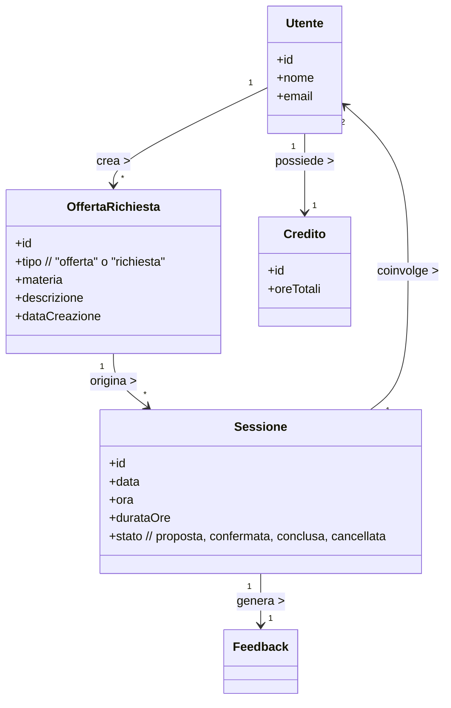
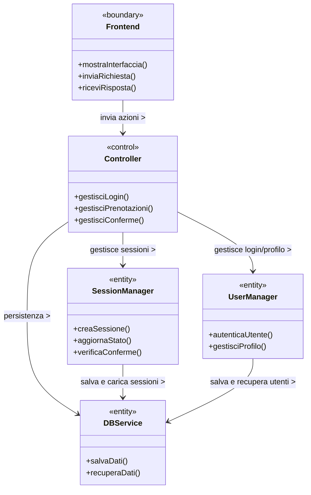
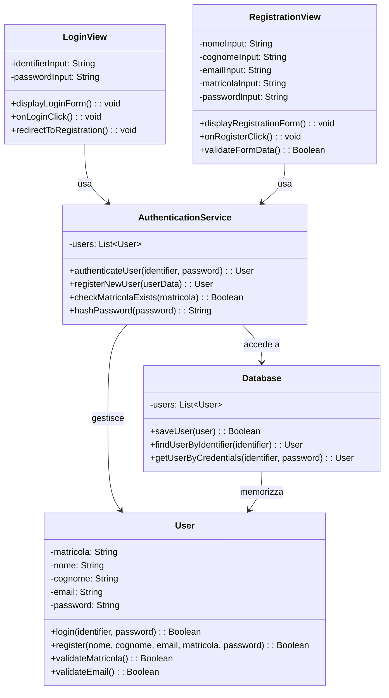
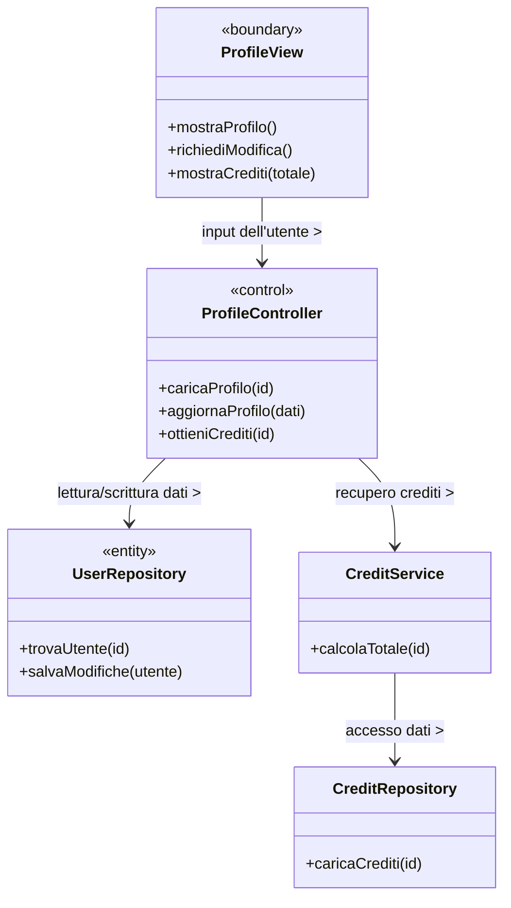
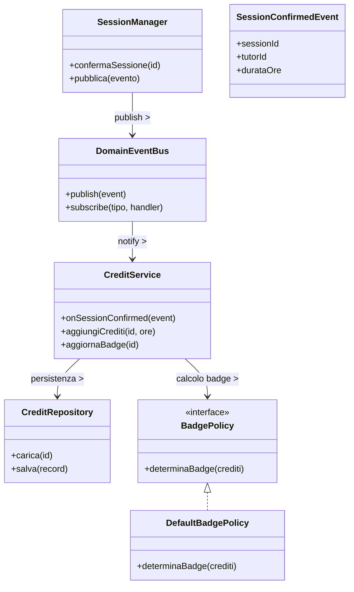
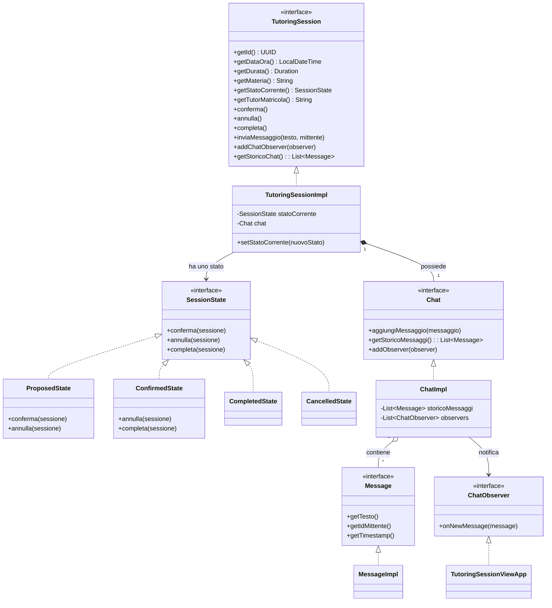
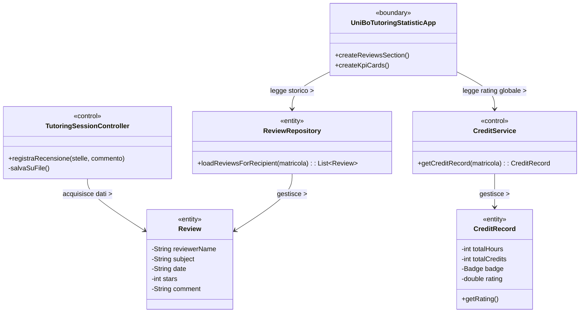
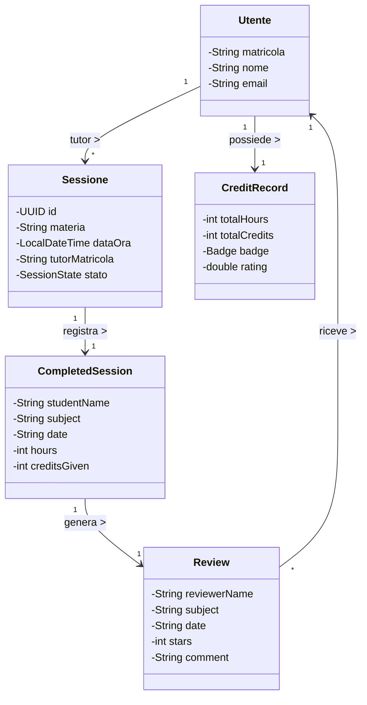

# Analisi

## Introduzione
In questa sezione vengono analizzati i requisiti e il dominio applicativo del progetto unibo_tutoring.
L'obiettivo è definire in modo chiaro cosa dovrà fare la nostra applicazione e quali elementi caratterizzano il contesto, senza entrare nei dettagli tecnici o progettuali.

## Analisi dei requisiti
L'applicazione unibo_tutoring nasce con lo scopo di creare una piattaforma digitale per gli studenti del Campus di Cesena dell'Università di Bologna in cui gli utenti possono mettersi in contatto per offrire o richiedere aiuti su specifiche materie.

**Requisiti funzionali**

L'applicazione dovrà permettere le seguenti funzionalità principali:
- Gli studenti potranno registrarsi e autenticarsi usando la matricola o l'email universitaria, garantendo così che l'accesso sia riservato agli studenti uniBo
- Gli utenti potranno creare, modificare ed eliminare box di offerta/richiesta di tutoraggio, in cui specificano il corso, la materia e una breve descrizione
- Potranno consultare le offerte e le richieste pubblicate da altri utenti, anche filtrandole per materia o corso
- Gli utenti potranno quindi proporre e accettare sessioni di tutoraggio, stabilendo data, orario e durata
- Ogni sessione dovrà passare attraverso diversi stati: proposta, confermata, conclusa o cancellata (stato che interrompe il flusso senza generare crediti)
- Deve essere disponibile una chat privata per la comunicazione diretta tra tutor e studente, utile a concordare i dettagli dell'incontro
- Ogni utente dovrà disporre di un profilo personale, con le informazioni base (nome, cognome, matricola) e le attività svolte

**Requisiti non funzionali**

Oltre alle funzionalità principali, l'applicazione dovrà garantire una buona esperienza d'uso e un funzionamento stabile. In particolare:
- Semplicità d'uso: interfaccia chiara e intuitiva, pensata per studenti che devono orientarsi facilmente tra le sezioni
- Affidabilità: i dati inseriti dagli utenti devono restare coerenti e sempre disponibili

## Analisi e modello del dominio

L'applicazione unibo_tutoring dovrà gestire le attività di tutoraggio tra studenti dell'Università di Bologna.
Il sistema ha lo scopo di favorire la collaborazione e il supporto reciproco tra studenti, permettendo a ciascuno di offrire o richiedere aiuto su specifiche materie universitarie e di accumulare crediti formativi in base alle ore di tutoraggio svolte.
Il dominio applicativo è costituito da una serie di entità e relazioni che descrivono le interazioni fondamentali tra gli studenti e gli elementi che compongono il servizio.
Ogni studente può assumere ruoli diversi a seconda del contesto: tutor, quando offre supporto su una materia, o studente, quando richiede aiuto.
Gli utenti interagiscono tramite la pubblicazione di box di tutoraggio, la creazione di sessioni di tutoraggio, e la comunicazione diretta attraverso una chat privata.

Gli elementi principali del dominio sono:
- Utente: rappresenta uno studente iscritto all'Università di Bologna.
- BoxTutoraggio: rappresenta un'offerta o una richiesta di tutoraggio. Contiene informazioni sulla materia e una breve descrizione.
- Sessione: indica un incontro di tutoraggio tra due utenti, caratterizzato da data, orario, durata e stato (proposta, confermata, conclusa o cancellata)
- Chat: rappresenta il canale di comunicazione tra gli utenti che partecipano a una sessione.
- Credito: rappresenta il numero di ore e CFU accumulati dal tutor per le attività svolte.

La difficoltà primaria sarà quella di gestire la coerenza dei ruoli tra offerta e richiesta, garantendo che le sessioni siano correttamente associate e confermate da entrambe le parti.
Un'ulteriore complessità riguarda il calcolo e la validazione dei crediti formativi, che devono riflettere con precisione le ore effettivamente svolte.
Infine, la gestione delle comunicazioni dirette e della prenotazione delle sessioni richiedono particolare attenzione per evitare sovrapposizioni di sessioni e per mantenere un sistema robusto e affidabile.

## Schema di analisi modello del dominio

Il sistema di tutoring gestisce studenti e tutor che possono proporre,
accettare o confermare sessioni di tutoraggio.  
Le entità principali del dominio sono `Utente`, `OffertaRichiesta`, `Sessione`,
`Feedback` e `Credito`.  
Lo schema seguente rappresenta i rapporti concettuali tra queste entità.


```mermaid
classDiagram
    %% ============================
    %% UML DEL DOMINIO - UNIBO TUTORING APP
    %% ============================

    class Utente {
        +id
        +nome
        +email
    }

    class OffertaRichiesta {
        +id
        +tipo  // "offerta" o "richiesta"
        +materia
        +descrizione
        +dataCreazione
    }

    class Sessione {
        +id
        +data
        +ora
        +durataOre
        +stato  // proposta, confermata, conclusa, cancellata
    }


    class Credito {
        +id
        +oreTotali
    }

    %% ============================
    %% RELAZIONI DEL DOMINIO
    %% ============================
    Utente "1" --> "*" OffertaRichiesta : crea >
    OffertaRichiesta "1" --> "*" Sessione : origina >
    Sessione "1" --> "2" Utente : coinvolge >
    Sessione "1" --> "1" Feedback : genera >
    Utente "1" --> "1" Credito : possiede >
```
# Design

## Architettura
L'architettura dell'applicazione unibo_tutoring segue il pattern MVC (Model-View-Controller).
In questa architettura, le tre componenti principali (Model, View e Controller) cooperano per gestire le funzionalità di tutoraggio, la persistenza dei dati e l'interazione con l'utente.
- Model: rappresenta il dominio applicativo: gestisce le entità principali (Utente, boxTutoraggio, Sessione, Chat, Credito) e le relazioni tra loro. Si occupa della logica dei dati, del calcolo dei crediti e dello stato delle sessioni.
- View: gestisce la parte grafica e interattiva dell'applicazione, mostrando i dati ricevuti dal Controller e aggiornandosi in base alle modifiche del Model.
- Controller: coordina le azioni dell'utente e media tra Model e View. È responsabile del flusso delle operazioni, come la creazione di un box di tutoraggio, la proposta di una sessione, o l'invio di messaggi in chat.

Questa suddivisione consente di mantenere il codice modulare, facilitando la gestione delle diverse sezioni dell'app (Dashboard, Chat, Profilo, ecc...) e rendendo possibile l'estensione futura con nuove funzionalità, come ad esempio l'integrazione con Teams.

 

L’applicazione di tutoring segue un’architettura di tipo **MVC**, (Model–View–Controller), ispirata al pattern **ECB** (Entity–Control–Boundary). Il frontend gestisce l’interfaccia e la comunicazione con l’utente, il controller coordina le operazioni principali e interagisce con i gestori di dominio, mentre il database garantisce la persistenza delle informazioni.

### Architettura – Schema UML


```mermaid
classDiagram
    %% =====================================
    %% UML ARCHITETTURALE - UNIBO_TUTORING
    %% Pattern MVC / ECB
    %% =====================================

    class Frontend {
        +mostraInterfaccia()
        +inviaRichiesta()
        +riceviRisposta()
    }
    <<boundary>> Frontend

    class Controller {
        +gestisciLogin()
        +gestisciPrenotazioni()
        +gestisciConferme()
    }
    <<control>> Controller

    class UserManager {
        +autenticaUtente()
        +gestisciProfilo()
    }
    <<entity>> UserManager

    class SessionManager {
        +creaSessione()
        +aggiornaStato()
        +verificaConferme()
    }
    <<entity>> SessionManager

    class DBService {
        +salvaDati()
        +recuperaDati()
    }
    <<entity>> DBService

    %% RELAZIONI
    Frontend --> Controller : invia azioni >
    Controller --> UserManager : gestisce login/profilo >
    Controller --> SessionManager : gestisce sessioni >
    Controller --> DBService : persistenza >
    SessionManager --> DBService : salva e carica sessioni >
    UserManager --> DBService : salva e recupera utenti >
```

## Design dettagliato- Gestione fasi Login e Registrazione
Il diagramma delle classi UML rappresenta la struttura del sistema di autenticazione del sito di tutoring, mostrando le principali classi coinvolte nel processo di registrazione e login degli utenti tramite numero di matricola oppure l'indirizzo email universitario e la password.
Il sistema è organizzato secondo una separazione tra interfaccia utente, logica applicativa e gestione dei dati.


```mermaid
classDiagram
    class User {
        -matricola: String
        -nome: String
        -cognome: String
        -email: String
        -password: String
        +login(identifier, password): Boolean
        +register(nome, cognome, email, matricola, password): Boolean
        +validateMatricola(): Boolean
        +validateEmail(): Boolean
    }
    class AuthenticationService {
        -users: List~User~
        +authenticateUser(identifier, password): User
        +registerNewUser(userData): User
        +checkMatricolaExists(matricola): Boolean
        +hashPassword(password): String
    }
    class LoginView {
        -identifierInput: String
        -passwordInput: String
        +displayLoginForm(): void
        +onLoginClick(): void
        +redirectToRegistration(): void
    }
    class RegistrationView {
        -nomeInput: String
        -cognomeInput: String
        -emailInput: String
        -matricolaInput: String
        -passwordInput: String
        +displayRegistrationForm(): void
        +onRegisterClick(): void
        +validateFormData(): Boolean
    }
    class Database {
        -users: List~User~
        +saveUser(user): Boolean
        +findUserByIdentifier(identifier): User
        +getUserByCredentials(identifier, password): User
    }
    LoginView --> AuthenticationService: usa
    RegistrationView --> AuthenticationService: usa
    AuthenticationService --> Database: accede a
    AuthenticationService --> User: gestisce
    Database --> User: memorizza
```

## Classe User
La classe User rappresenta l'entità principale del sistema, ovvero l'utente registrato alla piattaforma.
Gli attributi della classe contengono le informazioni personali necessarie per l'identificazione dell'utente:
- matricola: identificativo univoco dello studente
- nome: nome dell'utente
- cognome: cognome dell'utente
- email: indirizzo email dell'utente
- password: password associata all'account

La classe include inoltre diversi metodi che permettono la gestione delle operazioni di autenticazione:
- login(): verifica le credenziali inserite dall'utente per accedere al sistema
- register(): permette la creazione di un nuovo account utente
- validateMatricola(): controlla la validità del formato della matricola
- validateEmail(): verifica la correttezza dell'indirizzo email

## Classe AuthenticationService
La classe AuthenticationService gestisce la logica principale del sistema di autenticazione.
Essa funge da livello intermedio tra l'interfaccia utente e il database.

Gli attributi includono una lista di utenti registrati: users: List<User>

I metodi principali sono:
- authenticateUser(): verifica che l’identificativo inserito (matricola o e-mail) e la password inserite corrispondono a un utente registrato
- registerNewUser(): gestisce il processo di registrazione di un nuovo utente
- checkMatricolaExists(): controlla se una matricola è già presente nel sistema
- hashPassword(): converte la password in formato cifrato per garantire maggiore sicurezza

## Classe LoginView
La classe LoginView rappresenta l'interfaccia grafica utilizzata dall'utente per effettuare l'accesso al sistema.
Gli attributi rappresentano i campi inseriti dall'utente ovvero `identifierInput` (matricola o e-mail) e `passwordInput`.

I metodi gestiscono l'interazione con l'interfaccia:
- displayLoginForm(): mostra il modulo di login
- onLoginClick(): gestisce il tentativo di accesso dell'utente
- redirectToRegistration(): reindirizza l'utente alla pagina di registrazione nel caso non sia ancora registrato

## Classe RegistrationView

La classe RegistrationView invece, rappresenta l'interfaccia grafica per la registrazione di nuovi utenti.
Gli attributi corrispondono ai campi del modulo di registrazione quindi nomeInput,cognomeInput, emailInput, matricolaInput e passwordInput.

I metodi principali sono:
- displayRegistrationForm(): visualizza il modulo di registrazione
- onRegisterClick(): gestisce la richiesta di registrazione
- validateFormData(): verifica che tutti i dati inseriti siano corretti prima dell'invio

## Classe Database
La classe Database rappresenta il sistema di persistenza dei dati e contiene le informazioni sugli utenti registrati.
Essa include users: List<User>, che rappresenta l'insieme degli utenti memorizzati.

I metodi principali sono:
- saveUser(): salva un nuovo utente nel database
- findUserByMatricola(): ricerca un utente tramite matricola
- getUserByCredentials(): restituisce l'utente corrispondente alle credenziali inserite


## Design dettagliato- Gestione Profilo Utente


```mermaid
classDiagram
    %% ============================================================
    %% DESIGN DETTAGLIATO - PROFILO UTENTE(NIKI)
    %% Pattern: ECB (Entity-Control-Boundary)
    %% ============================================================

    class ProfileView {
        +mostraProfilo()
        +richiediModifica()
        +mostraCrediti(totale)
    }
    <<boundary>> ProfileView

    class ProfileController {
        +caricaProfilo(id)
        +aggiornaProfilo(dati)
        +ottieniCrediti(id)
    }
    <<control>> ProfileController

    class UserRepository {
        +trovaUtente(id)
        +salvaModifiche(utente)
    }
    <<entity>> UserRepository

    class CreditService {
        +calcolaTotale(id)
    }
 class CreditRepository {
        +caricaCrediti(id)
    }
    %% RELAZIONI
    ProfileView --> ProfileController : input dell'utente >
    ProfileController --> UserRepository : lettura/scrittura dati >
    ProfileController --> CreditService : recupero crediti >
    CreditService --> CreditRepository : accesso dati >
```
## SISTEMA ASSEGNAZIONE CREDITI & BADGE 

```mermaid
classDiagram
    %% ============================================================
    %% DESIGN DETTAGLIATO - CREDITI & BADGE (NIKI)
    %% Pattern: Observer + Strategy
    %% ============================================================

    class SessionManager {
        +confermaSessione(id)
        +pubblica(evento)
    }

    class SessionConfirmedEvent {
        +sessionId
        +tutorId
        +durataOre
    }

    class DomainEventBus {
        +publish(event)
        +subscribe(tipo, handler)
    }

    class CreditService {
        +onSessionConfirmed(event)
        +aggiungiCrediti(id, ore)
        +aggiornaBadge(id)
    }

    class CreditRepository {
        +carica(id)
        +salva(record)
    }

    class BadgePolicy {
        +determinaBadge(crediti)
    }
    <<interface>> BadgePolicy

    class DefaultBadgePolicy {
        +determinaBadge(crediti)
    }
    %% RELAZIONI
    SessionManager --> DomainEventBus : publish >
    DomainEventBus --> CreditService : notify >
    CreditService --> CreditRepository : persistenza >
    CreditService --> BadgePolicy : calcolo badge >
    BadgePolicy <|.. DefaultBadgePolicy
```
## GESTIONE SESSIONI E CHAT

Gli utenti di unibo_tutoring possono candidarsi a un annuncio di offerta o richiesta di tutoraggio e comunicare tramite una chat privata associata alla sessione. La sessione attraversa gli stati proposta, confermata, completata o cancellata; le sessioni future confermate vengono inoltre mostrate nel calendario personale dei partecipanti.



```mermaid
  %% ============================================================
    %% DESIGN DETTAGLIATO - SESSIONI E CHAT (ANDREA)
    %% Pattern: State + Observer + Facade
    %% ============================================================

    classDiagram

    class TutoringSession {
        <<interface>>
        +getId() UUID
        +getDataOra() LocalDateTime
        +getDurata() Duration
        +getMateria() String
        +getStatoCorrente() SessionState
        +getTutorMatricola() String
        +conferma()
        +annulla()
        +completa()
        +inviaMessaggio(testo, mittente)
        +addChatObserver(observer)
        +getStoricoChat() : List~Message~
    }

    class TutoringSessionImpl {
        -SessionState statoCorrente
        -Chat chat
        +setStatoCorrente(nuovoStato)
    }

    %% PATTERN STATE: Gestione degli stati
    class SessionState {
        <<interface>>
        +conferma(sessione)
        +annulla(sessione)
        +completa(sessione)
    }

    class ProposedState {
 
        +conferma(sessione)
        +annulla(sessione)
    }

    class ConfirmedState {

        +annulla(sessione)
        +completa(sessione)
    }

    class CompletedState {
    }

    class CancelledState {
    }

    TutoringSession <|.. TutoringSessionImpl
    TutoringSessionImpl --> SessionState : ha uno stato
    SessionState <|.. ProposedState
    SessionState <|.. ConfirmedState
    SessionState <|.. CompletedState
    SessionState <|.. CancelledState

    class Chat {
        <<interface>>
        +aggiungiMessaggio(messaggio)
        +getStoricoMessaggi() : List~Message~
        +addObserver(observer)
    }

    class ChatImpl {
        -List~Message~ storicoMessaggi
        -List~ChatObserver~ observers
    }

    class ChatObserver {
        <<interface>>
        +onNewMessage(message)
    }

    class Message {
        <<interface>>
        +getTesto()
        +getIdMittente()
        +getTimestamp() 
    }

    class MessageImpl
    class TutoringSessionViewApp

    Chat <|.. ChatImpl
    Message <|.. MessageImpl
    TutoringSessionImpl "1" *-- "1" Chat : possiede
    ChatImpl "1" o-- "*" Message : contiene
    ChatImpl --> ChatObserver : notifica
    ChatObserver <|.. TutoringSessionViewApp
```
### Scelte Progettuali: Gestione Sessioni e Chat (Andrea)

Il modulo relativo alla gestione delle sessioni di tutoraggio e della messaggistica privata è stato progettato per massimizzare la flessibilità e separare chiaramente le responsabilità.

#### 1. Gestione del ciclo di vita della Sessione (State Pattern)

Una `TutoringSession` attraversa le fasi Proposta, Confermata, Completata e Cancellata. Invece di gestire le transizioni con blocchi `if/switch` nella classe principale, si è scelto il **Pattern State**.

* **`SessionState` (Interfaccia):** Definisce le azioni possibili su una sessione (`conferma()`, `annulla()`, `completa()`).
* **Stati concreti (`ProposedState`, `ConfirmedState`, `CompletedState`, `CancelledState`):** Implementano le transizioni consentite. `CompletedState` e `CancelledState` sono terminali e rifiutano ulteriori transizioni tramite eccezioni.
* **Regole coordinate dal Controller:** `TutoringSessionController` persiste proposta e conferma, consente il completamento solo dopo la fine prevista e impone che il tutor confermi per primo; la transizione a `CompletedState` avviene soltanto dopo la conferma di entrambi. La pubblicazione del `SessionCompletedEvent` e il cambio di stato sono concentrati in `ConfirmedState.completa()`.
* **Controllo della disponibilità:** prima della conferma, il controller verifica tramite `SessionRepository` che né il tutor né lo studente abbiano un'altra sessione `Confirmed` sovrapposta. Il confronto considera l'intero intervallo data/ora-durata e consente sessioni consecutive, quando la seconda inizia esattamente alla fine della prima.
* **Modifica della programmazione:** l'autore può modificare data, ora e durata finché non è presente una candidatura attiva o un candidato confermato. Modello e View applicano lo stesso controllo.
* **Cancellazione e persistenza:** una sessione confermata può essere cancellata prima della fine prevista. Autore, data, motivo e lettura della notifica vengono salvati; la sessione cancellata rimane consultabile per 24 ore e lo stato `Cancelled` viene ripristinato dal file. `SessionLinkUtil` genera inoltre un identificativo di conversazione a partire dall'annuncio e dalla controparte, evitando collisioni fra sessioni diverse.
* **Vantaggi:** ogni stato mantiene isolate le proprie regole e l'aggiunta di un nuovo stato richiede una nuova implementazione di `SessionState` e l'aggiornamento delle sole transizioni che devono raggiungerlo.

#### 2. Architettura della Chat Privata (Composizione e Observer)
La `Chat` è modellata come un'entità separata, ma legata alla `TutoringSession` tramite una relazione di **Composizione**.
* La classe `TutoringSession` fa da facciata (Façade pattern) verso l'esterno: espone il metodo `inviaMessaggio(...)` facendo in realtà eseguire all'oggetto `Chat` interno.
* Il pattern **Observer** è implementato dal modello alla GUI: `ChatImpl` notifica i `ChatObserver` registrati, mentre `TutoringSessionViewApp` implementa l'interfaccia e aggiorna i messaggi sul thread JavaFX quando il proprio modello riceve un nuovo `Message`.
* I messaggi e i relativi timestamp vengono persistiti nel file condiviso della sessione. Il controller conserva anche lo stato di lettura della chat, usato dalla Dashboard per mostrare il simbolo di notifica alla controparte.

#### 3. Calendario personale

`SessionRepository` legge i file delle sessioni e restituisce, in ordine cronologico, soltanto quelle future in stato `Confirmed` alle quali partecipa l'utente. `UniBoTutoringProfileApp` usa il repository per popolare la sezione **I Tuoi Prossimi Impegni**, distinguendo le sessioni svolte come tutor da quelle ricevute come studente.


## GESTIONE FEEDBACK E RECENSIONI

Il modulo di feedback e recensioni consente agli utenti di valutare le sessioni di tutoraggio completate.

### Architettura del Sistema Review/Feedback


```mermaid
classDiagram
    %% ============================================================
    %% DESIGN DETTAGLIATO - FEEDBACK & REVIEWS
    %% Pattern: Repository + ECB (Entity-Control-Boundary)
    %% ============================================================

    class TutoringSessionController {
        +registraRecensione(stelle, commento)
        -salvaSuFile()
    }
    <<control>> TutoringSessionController

    class UniBoTutoringStatisticApp {
        +createReviewsSection()
        +createKpiCards()
    }
    <<boundary>> UniBoTutoringStatisticApp

    class Review {
        -String reviewerName
        -String subject
        -String date
        -int stars
        -String comment
    }
    <<entity>> Review

    class ReviewRepository {
        +loadReviewsForRecipient(matricola): List~Review~
    }
    <<entity>> ReviewRepository

    class CreditService {
        +getCreditRecord(matricola): CreditRecord
    }
    <<control>> CreditService

    class CreditRecord {
        -int totalHours
        -int totalCredits
        -Badge badge
        -double rating
        +getRating()
    }
    <<entity>> CreditRecord

    %% RELAZIONI
    TutoringSessionController --> Review : acquisisce dati >
    UniBoTutoringStatisticApp --> ReviewRepository : legge storico >
    UniBoTutoringStatisticApp --> CreditService : legge rating globale >
    ReviewRepository --> Review : gestisce >
    CreditService --> CreditRecord : gestisce >
```

### Classe Review

La classe `Review` rappresenta una valutazione di una sessione di tutoraggio completata, utilizzando un record Java (data class).

**Attributi:**
- `reviewerName`: nome dello studente che lascia la recensione
- `subject`: materia della sessione di tutoraggio
- `date`: data della sessione
- `stars`: voto numerico (scala 1-5)
- `comment`: testo libero con osservazioni specifiche

**Gestione:**
- Le recensioni sono memorizzate nel file CSV `data/reviews.csv`
- Ogni recensione contiene anche la matricola del tutor che le riceve (memorizzata come ultimo campo)
- Il record è immutabile (Java record), garantendo thread-safety

**Struttura del CSV:**
```
reviewerName;subject;date;stars;comment;tutorMatricola
Mario Rossi;Calcolo;2024-06-15;5;Ottima spiegazione;12345678
Laura Bianchi;Algebra;2024-06-14;4;Molto brava;87654321
```

### Classe ReviewRepository

La classe ReviewRepository gestisce il caricamento delle recensioni da file CSV per la consultazione dello storico.

Metodo principale:
- loadReviewsForRecipient(matricola): carica tutte le recensioni ricevute da un tutor specifico.
- Legge il file data/reviews.csv
- Filtra per matricola tutor (ultimo campo del CSV)
- Restituisce una List<Review>

**Esempio di utilizzo:**
```java
List<Review> reviews = ReviewRepository.loadReviewsForRecipient("12345678");
for (Review r : reviews) {
    System.out.println(r.reviewerName() + ": " + r.stars() + " stelle");
}
```

### Calcolo della media delle valutazioni 
La gestione delle valutazioni (rating) e delle recensioni è strutturata in questo modo e suddivisa tra diverse classi:
- UniBoTutoringStatisticApp: il rating medio viene letto direttamente tramite il record dei crediti;
- TutoringSessionController: salva e gestisce il valore delle singole recensioni a fine sessione tramite la variabile reviewStars;
- CreditRecord: è il modello di dati che memorizza il rating globale come semplice campo double rating;
- ReviewRepository: si occupa di recuperare dal database CSV (reviews.csv) lo storico delle recensioni ricevute da un tutor.

**Integrazione con CreditRecord:**
Il campo rating fa parte del profilo reputazionale dell'utente, modellato in CreditRecord. Al momento, la logica di calcolo non itera in tempo reale sulle recensioni, ma si appoggia al CreditService e al CreditRepository che provvedono a leggere il valore globale già pre-calcolato dal database o assegnando un valore di default qualora l'utente sia nuovo.

### Diagramma di Relazione tra Entità


```mermaid
classDiagram
    %% RELAZIONI DETTAGLIATE DEL SISTEMA REVIEW/FEEDBACK
    
    class Sessione {
        -UUID id
        -String materia
        -LocalDateTime dataOra
        -String tutorMatricola
        -SessionState stato
    }

    class Utente {
        -String matricola
        -String nome
        -String email
    }

    class Review {
        -String reviewerName
        -String subject
        -String date
        -int stars
        -String comment
    }

    class CompletedSession {
        -String studentName
        -String subject
        -String date
        -int hours
        -int creditsGiven
    }

    class CreditRecord {
        -int totalHours
        -int totalCredits
        -Badge badge
        -double rating
    }

    Sessione "1" --> "1" CompletedSession : registra >
    CompletedSession "1" --> "1" Review : genera >
    Utente "1" <-- "*" Review : riceve >
    Utente "1" --> "*" Sessione : tutor >
    Utente "1" --> "1" CreditRecord : possiede >
```

### Scelte Progettuali Review e Feedback

Il modulo relativo alla gestione delle recensioni e del sistema di feedback è stato progettato puntando su semplicità, immutabilità e chiara separazione delle responsabilità, al fine di garantire un'esperienza utente affidabile e un codice facilmente manutenibile.

**1. Modello Dati Immutabile (Java Record)**
Per rappresentare la singola recensione nel dominio applicativo, si è scelto di utilizzare il costrutto record di Java (ReviewRepository.Review).
Vantaggio: Le recensioni, una volta emesse, sono entità storiche che non devono subire modifiche. L'uso di un record garantisce l'immutabilità nativa di tutti i suoi campi (nome, materia, data, stelle, commento).

**2. Separazione delle Responsabilità (Separation of Concerns)**
Il ciclo di vita di una recensione è stato diviso in base al contesto operativo, evitando classi "monolitiche":
- Fase di Acquisizione: è demandata al TutoringSessionController. La recensione è concettualmente un output di una sessione conclusa; pertanto, il controller della sessione gestisce l'input delle stelle (da 1 a 5) e del commento, salvandoli direttamente all'interno dello stato della specifica sessione.
- Fase di Consultazione: delegata al ReviewRepository, un componente leggero che accede al database (reviews.csv) per mappare lo storico globale del tutor.
  
**3. Persistenza Lightweight (File CSV)**
Coerentemente con il resto dell'architettura del progetto, i feedback sono persistiti in formato testuale CSV (data/reviews.csv).
Vantaggio: L'applicazione è indipendente da database esterni (DBMS) e i dati sono facilmente trasportabili, il che è perfetto per un approccio autonomo. 

**4. Aggregazione Efficace nel Modello Utente (Caching del Rating)**
Per garantire caricamenti rapidi, il sistema non ricalcola la media dei voti leggendo l'intero file CSV delle recensioni ad ogni avvio della dashboard. Al contrario, la media viene salvata come un singolo numero già calcolato (il campo rating) all'interno del profilo globale dell'utente (CreditRecord). Grazie a questo approccio, il punteggio dell'utente è sempre immediatamente disponibile per essere mostrato nel profilo o negli annunci, senza pesare sulle prestazioni dell'applicazione.

**5. Gestione UI Reattiva e Funzionale**
Lato interfaccia (UniBoTutoringStatisticApp), l'integrazione del sistema di feedback sfrutta le API funzionali di Java (Streams).
Le recensioni recuperate dal repository vengono processate dinamicamente, ordinate in ordine cronologico inverso (mostrando sempre in cima le più recenti valutando in modo safe le stringhe delle date) e renderizzate in schede grafiche iniettate in uno ScrollPane. 

# Sviluppo

## Testing automatizzato

Il progetto usa test automatici JUnit eseguibili con:

```bash
./gradlew test
```

Il progetto contiene 45 metodi annotati con `@Test` distribuiti in undici classi. I test coprono disponibilità del runtime JavaFX, autenticazione, annunci, componenti condivisi dell'interfaccia, navigazione, sessioni, chat e persistenza.

### Andrea

- `TutoringSessionTest`: stato iniziale, transizioni lecite e illecite, Façade della chat e inoltro delle notifiche Observer.
- `TutoringSessionControllerTest`: persistenza di messaggi e recensioni, separazione delle chat, confini temporali del completamento e della cancellazione, doppia conferma, evento pubblicato una sola volta, messaggi non letti, cancellazione persistente e riparazione di file privi di newline finale.
- `SessionOverlapTest`: sovrapposizioni parziali e contenitive, intervalli adiacenti, sessioni irrilevanti, appuntamenti già iniziati e ancora attivi ed esclusione del file corrente.
- `SessionRepositoryTest`: selezione delle sole sessioni confermate e future per il calendario.
- `ChatTest`: memorizzazione del messaggio e notifica dell'observer.

Le regole che dipendono dal tempo espongono varianti testabili con un `LocalDateTime` esplicito, così da verificare esattamente gli istanti di confine.

### Sofia

- 'AuthServiceTest': controlla la registrazione e le credenziali. Verifica che le password rispettino i requisiti e che non si possano creare due account con la stessa matricola o la stessa e-mail. Controlla anche che la registrazione venga effettivamente salvata nel file degli utenti.
- 'TutoringSessionControllerTest': controlla il flusso delle recensioni. Verifica che, dopo una sessione completata correttamente, lo studente possa lasciare una recensione e che stelle e commento vengano salvati in 'reviews.csv'. Permette inoltre al tutor di ritrovare la recensione caricandola tramite la propria matricola. Controlla inoltre che il file resti ben formattato anche se non termina con un ritorno a capo.

I seguenti file di test verificano che le funzionalità principali funzionino anche senza aprire l’interfaccia grafica.

## Note di sviluppo

### Andrea 

#### Stream, Optional e record per il controllo degli intervalli

**Dove:** [`it.unibo.tutoring.model.session.SessionRepository`](https://github.com/Sil2564/unibo_tutoring/blob/main/src/main/java/it/unibo/tutoring/model/session/SessionRepository.java)

```java
try (Stream<Path> paths = Files.list(SESSION_FOLDER)) {
    return paths.filter(SessionRepository::isSessionFile)
            .filter(path -> !samePath(path, sessioneDaEscludere))
            .map(this::parseSessionFile)
            .filter(Objects::nonNull)
            .filter(SessionFileData::isConfirmed)
            .filter(session -> session.involves(matricola))
            .filter(session -> overlaps(
                    nuovoInizio,
                    nuovaFine,
                    session.dataOra(),
                    session.fine()))
            .sorted(Comparator.comparing(SessionFileData::dataOra))
            .map(session -> new SessionConflict(
                    session.materia(),
                    session.dataOra(),
                    session.fine()))
            .findFirst();
}
```

La pipeline usa `Stream<Path>` con chiusura automatica, method reference, lambda, `Comparator`, `Optional` e un `record` immutabile per restituire il conflitto. La sequenza esprime in modo dichiarativo tutte le condizioni che rendono una sessione rilevante.

#### Parsing compatibile e gestione mirata delle righe non valide

**Dove:** [`it.unibo.tutoring.controller.session.TutoringSessionController`](https://github.com/Sil2564/unibo_tutoring/blob/main/src/main/java/it/unibo/tutoring/controller/session/TutoringSessionController.java)

```java
if (line.startsWith("STATO;")) {
    ripristinaStato(line.substring("STATO;".length()));
} else if (line.startsWith("MSG2;")) {
    ripristinaMessaggioConTimestamp(line.substring("MSG2;".length()));
} else if (line.startsWith("MSG;")) {
    ripristinaMessaggioLegacy(line.substring("MSG;".length()));
} else if (line.startsWith("COMPLETO_TUTOR;")) {
    this.completatoTutor = Boolean.parseBoolean(
            line.substring("COMPLETO_TUTOR;".length()).trim());
} else if (line.startsWith("COMPLETO_STUDENTE;")) {
    this.completatoStudente = Boolean.parseBoolean(
            line.substring("COMPLETO_STUDENTE;".length()).trim());
}
```

Il caricamento riconosce sia `MSG2`, che include il timestamp, sia il formato legacy `MSG`. Una singola riga con timestamp non valido viene ignorata senza perdere il resto della sessione. L'approccio consente di evolvere il formato persistente preservando i dati già creati.

#### Collezioni ordinate per ricevute di lettura e notifiche

**Dove:** [`it.unibo.tutoring.controller.session.TutoringSessionController`](https://github.com/Sil2564/unibo_tutoring/blob/main/src/main/java/it/unibo/tutoring/controller/session/TutoringSessionController.java)

```java
private final Set<String> cancellazioneVistaDa = new LinkedHashSet<>();
private final Set<String> chatVistaDa = new LinkedHashSet<>();

public boolean haMessaggiChatNonLetti() {
    if (!this.statoLetturaChatPresente
            || this.chatVistaDa.contains(this.userMatricola)) {
        return false;
    }
    return this.model.getStoricoChat().stream()
            .anyMatch(message -> !SYSTEM_SENDER_ID.equals(message.getIdMittente())
                    && !this.userMatricola.equals(message.getIdMittente()));
}
```

`LinkedHashSet` impedisce duplicati e produce una serializzazione deterministica. `Stream.anyMatch` termina appena trova un messaggio effettivamente ricevuto, escludendo messaggi di sistema e messaggi inviati dall'utente stesso.

#### Aggiornamento sicuro della vista sul JavaFX Application Thread

**Dove:** [`it.unibo.tutoring.view.session.TutoringSessionViewApp`](https://github.com/Sil2564/unibo_tutoring/blob/main/src/main/java/it/unibo/tutoring/view/session/TutoringSessionViewApp.java)

```java
@Override
public void onNewMessage(final Message message) {
    if (this.messageArea == null) {
        return;
    }

    final Runnable update = () -> aggiornaMessaggi(this.messageArea);
    if (Platform.isFxApplicationThread()) {
        update.run();
    } else {
        Platform.runLater(update);
    }
}
```

La callback Observer può essere invocata da un thread diverso da quello grafico. Il controllo su `Platform.isFxApplicationThread()` evita aggiornamenti JavaFX non sicuri e usa `Platform.runLater` soltanto quando necessario.

### Sofia

#### Binding bidirezionale e proprietà osservabili per la visibilità della password
**Dove:** [`it.unibo.tutoring.UniBoTutoringLoginApp`](src/main/java/it/unibo/tutoring/UniBoTutoringLoginApp.java)

```java
 visiblePasswordField.textProperty().bindBidirectional(passwordField.textProperty());
        visiblePasswordField.setVisible(false);
        visiblePasswordField.setManaged(false);

        final AppIcon hiddenIcon = new AppIcon("eye_close.png", 22, 22);
        final AppIcon visibleIcon = new AppIcon("eye.png", 22, 22);
        //crea il pulsante per mostrare/nascondere la password
        final Button toggleVisibilityButton = new Button("", hiddenIcon);
        toggleVisibilityButton.setCursor(Cursor.HAND);
        toggleVisibilityButton.setStyle("-fx-background-color: transparent; -fx-padding: 6;");
        //toggleVisibilityButton.setFocusTraversable(false);

        //crea una variabile booleana per lo stato di visibilità della password
        //inizialmente la password è nascosta
        final BooleanProperty passwordVisible = new SimpleBooleanProperty(false);
        passwordVisible.addListener((observable, oldValue, newValue) -> {
            passwordField.setVisible(!newValue);
            passwordField.setManaged(!newValue);
            visiblePasswordField.setVisible(newValue);
            visiblePasswordField.setManaged(newValue);
            toggleVisibilityButton.setGraphic(newValue ? visibleIcon : hiddenIcon);
        });
        //al click del pulsante cambia lo stato di visibilità della password
        toggleVisibilityButton.setOnAction(event -> passwordVisible.set(!passwordVisible.get()));
```
In questo codice viene utilizzato un binding bidirezionale tra due campi di testo. Vengono usati due campi collegati tra loro, uno in chiaro e uno con la password nascosta. Il loro testo si sincronizza in automatico: quando l'utente clicca sull'icona dell'occhio, il sistema mostra o nasconde il campo giusto e aggiorna l'icona in tempo reale.


#### Calcolo della valutazione media tramite Stream

**Dove:** [`it.unibo.tutoring.UniBoTutoringStatisticApp`](src/main/java/it/unibo/tutoring/UniBoTutoringStatisticApp.java)

Metodo `createKpiCards`

```java
 List<Review> reviews = ReviewRepository.loadReviewsForRecipient(matricola);
    
    /**
     * @stream() trasforma la lista in un flusso 
     * @mapToInt(Review::stars) estrae il voto numerico delle recensioni 
     * @average calcola la media 
     * @orElse(0.0) restituisce zero se non si hanno recensioni */
 double avgRating = reviews.stream()
.mapToInt(Review::stars)
.average()
.orElse(0.0);
```
Il codice vede l'utilizzo di Stream API per estrarre i voti dalle recensioni (`mapToInt`), calcolarne la media (`average`) e gestire l’assenza di recensioni con `.orElse(0.0)`.


#### Elaborazione funzionale dei dati per il grafico mensile

**Dove:** [`it.unibo.tutoring.UniBoTutoringStatisticApp`](src/main/java/it/unibo/tutoring/UniBoTutoringStatisticApp.java)

Metodo `createMonthlySessionsChart`

```java
  sessions.stream()
        //prende le sessioni, ne estrae le date e le trasforma in LocalDate
            .map(session -> parseDateSafe(session.date()))
        //scarta le date non valide 
            .filter(date -> !date.equals(LocalDate.MIN))
            .sorted()  //ordina cronologicamente
            //prende ogni data
            .forEach(date -> {
            //applica il DateTimeFormatter definito in precedenza
                final String monthLabel = date.format(formatter);
                //cerca nella mappa se esiste già una chiave corrispondente a monthLabel
                countsByMonth.put(monthLabel, countsByMonth.getOrDefault(monthLabel, 0) + 1); //prende il valore ottenuto ed aggiunge 1
            });
```
Il seguente frammento di codice utilizza una pipeline di operazioni Stream (`map, filter, sorted e forEach`). Questi passaggi permettono di convertire le date delle sessioni, escludere quelle non valide, ordinarle cronologicamente e aggiornare il conteggio mensile all’interno di una `LinkedHashMap`, preservando l’ordine di inserimento necessario per il grafico.


# Commenti finali

## Autovalutazione e lavori futuri

### Andrea 

Lo sviluppo di questo progetto è stato molto interessante e formativo, mi ha permesso di scoprire in maniera più approfondita e realistica le varie dinamiche e fasi di gestione di un software di piccole-medie dimensioni, con particolare attenzione al lavoro di gruppo e come gestire imprevisti disaccordi e problematiche che si possono verificare durante quest’ultimo.
Aver visto la programmazione a oggetti con un linguaggio differente da quello imparato durante il mio percorso di studi precedente e nel mondo del lavoro (C# e PHP) mi ha permesso di cogliere nuove sfumature dell'architettura software. Il risultato finale mi ha soddisfatto molto, nonostante sia ancora possibile effettuare migliorie al codice e implementare o migliorare funzionalità. 
Lavorare in un gruppo di 4 persone trovo che sia stato estremamente formativo dato che spero in futuro di lavorare in un team composto da un numero anche più grande di questo. Ciò mi ha permesso di approfondire l'uso di Git e gestire casi di merge quando si opera su stessi file in più persone e soprattutto ho imparato a collaborare con persone che programmano e ragionano in modo diverso rispetto al mio.


## Difficoltà incontrate e commenti per i docenti

La difficoltà più importante durante lo sviluppo è stata la coordinazione di tutti i membri del gruppo, considerando anche che 3 membri su 4 hanno svolto o stanno tutt'ora svolgendo i tirocini, motivo per cui la realizzazione è durata oltre 10 mesi partendo dalla creazione dell'idea e della repository, in modo però discontinuo un po' per tutti.
Inoltre reperire le registrazioni di alcune lezioni potrebbe risultare difficile dato che sono presenti solamente su teams con una scadenza.

# Guida utente

## Requisiti di esecuzione

La configurazione corrente richiede un JDK 25. 

Avvio su Linux o macOS:

```bash
./gradlew run
```

Avvio su Windows:

```powershell
./gradlew.bat run
```

Esecuzione dei test:

```bash
./gradlew test
```

Creazione del fat JAR:

```bash
./gradlew shadowJar
```

Il file generato si trova nella cartella `build/libs`. 

## Registrazione e accesso

1. Dalla home selezionare **Registrati**.
2. Inserire nome, cognome, data di nascita, corso di studi, matricola di dieci cifre, e-mail e password.
3. La password deve contenere almeno sei caratteri, una maiuscola, una minuscola, un numero e un carattere speciale.
4. Dopo la registrazione selezionare **Accedi** e usare la matricola oppure l'e-mail insieme alla password.

## Consultazione e creazione degli annunci

1. Dopo l'accesso viene mostrata la dashboard.
2. Usare la ricerca e i filtri per limitare gli annunci visualizzati.
3. Aprire un annuncio per consultarne autore, materia, argomento, programmazione e nota.
4. Per pubblicare un nuovo annuncio selezionare **+ Crea Annuncio**, scegliere se si tratta di un'offerta o di una richiesta e compilare tutti i dati richiesti.
5. L'autore può usare **Modifica data e orario** finché l'annuncio non possiede candidature attive o un candidato confermato.
6. Con **Elimina annuncio** l'autore rimuove l'annuncio. Se esiste già una sessione confermata, la cancellazione rimane temporaneamente visibile alle persone coinvolte.

## Contatto, candidatura e conferma

1. Selezionare **Contatta** per aprire una conversazione con l'autore senza candidarsi automaticamente.
2. Selezionare **Candidati** per proporre la propria partecipazione. Finché la candidatura è pendente è possibile scegliere **Ritira candidatura**.
3. L'autore vede i candidati nel dettaglio dell'annuncio e può usare **Conferma** o **Rifiuta**.
4. Al momento della conferma il sistema controlla gli impegni di entrambi. Se esiste una sessione confermata sovrapposta, la conferma viene rifiutata e viene mostrato l'intervallo in conflitto.

## Chat e gestione della sessione

1. Dal dettaglio dell'annuncio selezionare **Apri chat**.
2. Scrivere il testo nel campo dedicato e premere **Invia**. I messaggi mostrano mittente e orario e rimangono disponibili dopo il riavvio.
3. Una notifica segnala alla controparte i nuovi messaggi; l'apertura della chat li marca come letti.
4. Prima della fine prevista, ciascun partecipante può usare **Annulla sessione** e inserire un motivo facoltativo. La controparte riceve un messaggio di sistema e la sessione cancellata rimane consultabile per 24 ore.
5. Dopo l'orario di fine il tutor può selezionare **Segna come completata**. Lo studente potrà fare lo stesso soltanto dopo la conferma del tutor.
6. Quando entrambi hanno confermato, la sessione passa a completata e le ore vengono aggiunte al progresso del tutor.
7. Lo studente può quindi selezionare da una a cinque stelle, aggiungere un commento facoltativo e inviare la recensione.

## Profilo, calendario e statistiche

- Dal profilo personale è possibile vedere i dati dell'account, modificare password, immagine e presentazione, e consultare ore, crediti, badge e recensioni.
- La data di nascita viene visualizzata ma non è modificabile dal profilo.
- La sezione **I Tuoi Prossimi Impegni** mostra soltanto le sessioni future confermate, ordinate cronologicamente, indicando se l'utente partecipa come tutor o come studente.
- La pagina statistiche riassume progressi, valutazioni ricevute e sessioni recenti.
- Visitando il profilo di un altro utente si visualizzano le sue informazioni pubbliche senza mostrare il comando di logout del visitatore all'interno di quel profilo.

## Persistenza dei dati

I dati applicativi sono salvati nella cartella `data`. Le sessioni e le chat usano file nella sottocartella `data/sessions`; gli altri repository mantengono utenti, annunci, crediti, sessioni concluse e recensioni nei rispettivi file CSV. Spostare o cancellare questi file modifica lo stato disponibile al successivo avvio.
